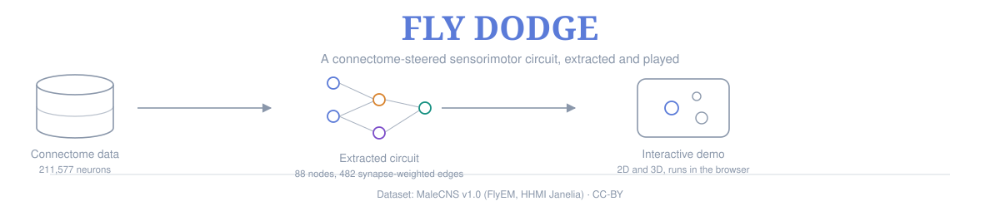

<p align="center"><svg viewBox="0 0 1200 260" xmlns="http://www.w3.org/2000/svg" role="img" aria-label="Fly Dodge: connectome data to extracted circuit to interactive demo" xmlns:c2pa="http://c2pa.org/manifest"><metadata></metadata>
  <defs>
    <marker id="ar" viewBox="0 0 10 10" refX="9" refY="5" markerWidth="7" markerHeight="7" orient="auto">
      <path d="M0 0L10 5L0 10z" fill="#8a97aa"/>
    </marker>
  </defs>
  <text x="600" y="48" text-anchor="middle" font-family="Georgia, 'Iowan Old Style', serif" font-size="40" font-weight="700" fill="#5b7bd8">FLY DODGE</text>
  <text x="600" y="76" text-anchor="middle" font-family="Helvetica, Arial, sans-serif" font-size="15" fill="#8a97aa">A connectome-steered sensorimotor circuit, extracted and played</text>

  <!-- stage 1: data -->
  <g transform="translate(90,130)">
    <ellipse cx="0" cy="-28" rx="46" ry="12" fill="none" stroke="#8a97aa" stroke-width="1.6"/>
    <path d="M -46 -28 L -46 24 A 46 12 0 0 0 46 24 L 46 -28" fill="none" stroke="#8a97aa" stroke-width="1.6"/>
    <path d="M -46 -2 A 46 12 0 0 0 46 -2" fill="none" stroke="#8a97aa" stroke-width="1.2" opacity=".6"/>
    <text x="0" y="60" text-anchor="middle" font-family="Helvetica, Arial, sans-serif" font-size="13.5" fill="#8a97aa">Connectome data</text>
    <text x="0" y="78" text-anchor="middle" font-family="Helvetica, Arial, sans-serif" font-size="11.5" fill="#8a97aa">211,577 neurons</text>
  </g>
  <line x1="165" y1="130" x2="325" y2="130" stroke="#8a97aa" stroke-width="1.6" marker-end="url(#ar)"/>

  <!-- stage 2: circuit -->
  <g transform="translate(455,130)">
    <circle cx="-55" cy="-30" r="7" fill="none" stroke="#5b7bd8" stroke-width="1.8"/>
    <circle cx="-55" cy="10" r="7" fill="none" stroke="#5b7bd8" stroke-width="1.8"/>
    <circle cx="0" cy="-10" r="7" fill="none" stroke="#d9822b" stroke-width="1.8"/>
    <circle cx="0" cy="30" r="7" fill="none" stroke="#7b4bc9" stroke-width="1.8"/>
    <circle cx="55" cy="0" r="7" fill="none" stroke="#138f80" stroke-width="1.8"/>
    <g stroke="#8a97aa" stroke-width="1" opacity=".75">
      <line x1="-48" y1="-30" x2="-7" y2="-11"/>
      <line x1="-48" y1="10" x2="-7" y2="-8"/>
      <line x1="-48" y1="10" x2="-7" y2="28"/>
      <line x1="7" y1="-10" x2="48" y2="-1"/>
      <line x1="7" y1="29" x2="48" y2="3"/>
    </g>
    <text x="0" y="65" text-anchor="middle" font-family="Helvetica, Arial, sans-serif" font-size="13.5" fill="#8a97aa">Extracted circuit</text>
    <text x="0" y="83" text-anchor="middle" font-family="Helvetica, Arial, sans-serif" font-size="11.5" fill="#8a97aa">88 nodes, 482 synapse-weighted edges</text>
  </g>
  <line x1="530" y1="130" x2="690" y2="130" stroke="#8a97aa" stroke-width="1.6" marker-end="url(#ar)"/>

  <!-- stage 3: demo -->
  <g transform="translate(820,130)">
    <rect x="-55" y="-35" width="110" height="70" rx="10" fill="none" stroke="#8a97aa" stroke-width="1.6"/>
    <circle cx="-14" cy="0" r="8" fill="none" stroke="#5b7bd8" stroke-width="1.8"/>
    <circle cx="16" cy="-14" r="5" fill="none" stroke="#8a97aa" stroke-width="1.4"/>
    <circle cx="22" cy="12" r="7" fill="none" stroke="#8a97aa" stroke-width="1.4"/>
    <text x="0" y="60" text-anchor="middle" font-family="Helvetica, Arial, sans-serif" font-size="13.5" fill="#8a97aa">Interactive demo</text>
    <text x="0" y="78" text-anchor="middle" font-family="Helvetica, Arial, sans-serif" font-size="11.5" fill="#8a97aa">2D and 3D, runs in the browser</text>
  </g>

  <line x1="60" y1="210" x2="1140" y2="210" stroke="#8a97aa" stroke-width="1" opacity=".35"/>
  <text x="600" y="238" text-anchor="middle" font-family="Helvetica, Arial, sans-serif" font-size="12" fill="#8a97aa">Dataset: MaleCNS v1.0 (FlyEM, HHMI Janelia) · CC-BY</text>
</svg>

  
width="760">
</p>

<h1 align="center">Fly Dodge</h1>
<p align="center"><i>A playable sensorimotor circuit extracted from the <code>male-cns:v1.0</code> <i>Drosophila</i> connectome</i></p>

<p align="center">
  
  
  
  
</p>

---

## Abstract

Connectomics datasets now provide synapse-resolution wiring diagrams for entire insect nervous systems, but turning that wiring into a *running* sensorimotor controller — rather than a static graph — requires a series of modelling choices that are rarely made explicit. This project extracts a small, real escape circuit from the male *Drosophila melanogaster* central nervous system connectome (four looming-sensitive visual projection neuron types, their strongest interneuron relays, and the descending neurons they drive) and wires it into two interactive simulations: a 2D game and a free-flight 3D environment, in which a simulated fly dodges falling obstacles using only the extracted circuit's real, synapse-weighted output. Every quantity that comes directly from the data — cell counts, synapse weights, predicted neurotransmitter identity — is kept separate, in code and in this documentation, from quantities that are necessary modelling assumptions (e.g. the geometric rule mapping neural activity to a steering direction, for which the connectome itself provides no ground truth). The result is a working demonstration of the connectome-extraction pipeline, an honest audit of where biological data ends and engineering assumption begins, and a sandbox for testing whether the extracted wiring behaves differently from a randomized control of itself.

## Table of contents

1. [Motivation](#1-motivation)
2. [Data](#2-data)
3. [Method: circuit extraction](#3-method-circuit-extraction)
4. [Model: sensorimotor circuit](#4-model-sensorimotor-circuit)
5. [Implementation](#5-implementation)
6. [Results](#6-results)
7. [Limitations and assumptions](#7-limitations-and-assumptions)
8. [Future work](#8-future-work)
9. [Repository structure](#9-repository-structure)
10. [Getting started](#10-getting-started)
11. [Citation](#11-citation)
12. [License and acknowledgments](#12-license-and-acknowledgments)
13. [References](#13-references)

## 1. Motivation

Edge-deployed autonomous systems (small drones in particular) face a hard constraint: obstacle avoidance has to run on very limited compute and power budgets. Insect visual systems solve an equivalent problem with a few hundred neurons. This project is a first, deliberately small step toward asking whether a *real*, data-derived wiring diagram — rather than a hand-designed or end-to-end-trained network of similar size — produces different, and specifically more robust, avoidance behaviour. It does **not** claim to have answered that question; see [§7](#7-limitations-and-assumptions) and [§8](#8-future-work) for exactly what is and isn't established here.

## 2. Data

[MaleCNS](https://male-cns.janelia.org/) (`male-cns:v1.0`), an electron-microscopy reconstruction of the central nervous system of a male *D. melanogaster*, released by FlyEM (HHMI Janelia), the University of Cambridge, the MRC Laboratory of Molecular Biology, and Google Research, under CC-BY. The release provides 211,577 annotated neurons and a connectivity table of 151,856,684 directed neuron-to-neuron synapse counts. Only three of the seven released tables are used (≈1.2 GB of the ≈24 GB release): body annotations (cell type, soma side, class), predicted neurotransmitter identity per neuron, and the synapse-weight table.

| Cell population | Role here | Neurons |
|---|---:|---:|
| LPLC2, LC4, LC6, LPLC1 | Looming-sensitive visual projection neurons — the model's sensory input | 569 |
| Descending neurons (all types) | Candidate motor output | 1,314 (481 types) |

## 3. Method: circuit extraction

A single script (`scripts/03_export_circuit.py`) reduces the full connectivity table to a small, game-sized circuit:

1. Group neurons by **cell type × body side** (e.g. `LPLC2_L`), rather than treating each neuron individually or each type as side-agnostic.
2. Scan the 152M-row weight table once, in 10M-row chunks, retaining only edges that leave a sensor node or arrive at a descending-neuron node — bounding memory use regardless of table size.
3. Identify two path types: **direct** (sensor → descending neuron) and **two-step** (sensor → interneuron → descending neuron).
4. Rank candidate interneuron nodes by `score = √(synapses received from sensors × synapses sent to descending neurons)`, keep the top 40.
5. Rank descending-neuron nodes by total incoming drive (direct + two-step through the retained interneurons), keep the top 40.
6. Assign each node a sign (+1 / −1 / 0) from its neurons' majority predicted neurotransmitter (acetylcholine → excitatory, GABA/glutamate → inhibitory).
7. Emit `flybrain_circuit.json`: 88 nodes, 482 edges, each edge carrying its real, aggregated synapse weight.

Full walkthrough, including a worked numerical example of the ranking step: [`docs/index.html`](docs/index.html#export).

## 4. Model: sensorimotor circuit

Each node is a single leaky, rectified-saturating rate unit (not a spiking or compartmental model):

```
τ · da/dt = −a + f(x),      f(x) = x / (1 + x)  for x > 0, else 0
x_j = gain · (Σ_i sign(i) · w_ij · a_i) / scale(layer) + noise
```

where `w_ij` is the real, per-post-neuron-normalized synapse weight from the connectome. Sensor-node activity is driven by a looming signal computed from each falling obstacle's angular expansion rate and time-to-collision (an engineering choice, not a fitted visual model). Descending-neuron output is summed by body side (`S_L`, `S_R`) and decoded into a steering command. **The decoding rule is the one part of the pipeline with no connectome support**: it is a modelling necessity, stated as such throughout the documentation and in-game notes, not a finding.

## 5. Implementation

Two self-contained, dependency-free (beyond three.js for 3D) HTML demos run the same extracted circuit:

| | 2D (`game/fly_dodge.html`) | 3D (`game/fly_dodge_3d.html`) |
|---|---|---|
| Fly | Hovers, sidesteps on 2 axes | Free-flight, steers on 3 axes (yaw from data, pitch assumed) |
| Obstacles | Fall straight down | Fall from random points, drift, bounce off walls |
| Camera | Fixed | Third-person chase, or a free camera (arrow keys + mouse-look) |
| Visual | Abstract dot | A digitized fly model, not derived from the connectome (see [§12](#12-license-and-acknowledgments)) |

Both load `flybrain_circuit.json` client-side; no server, build step, or API key is required.

## 6. Results

All reported hit/dodge statistics use a **stand-in circuit** built from the real export's reported interneuron and descending-neuron totals, not the full real `flybrain_circuit.json` — see [§7](#7-limitations-and-assumptions) for why, and run the real file yourself to get the result that actually matters.

| Condition | 2D hit rate (single-drop sweep) | 3D hit rate (rain, 6-seed average) |
|---|---:|---:|
| Intact wiring | 3% | 19% |
| Rewired (same weights, randomized targets) | 12% | 14%* |
| Looming sensors silenced | 68% | — |
| Brain disconnected | 71% | 100% |

<sub>*On the stand-in circuit's built-in redundancy; see the caveat in `docs/index.html#v3d-testing`. The brain-disconnected comparison (100% hit rate with no evasive circuit at all, vs. ≤20% with one, in any wiring) is the one result load-bearing enough to trust from this stand-in test.</sub>

A full account of every test performed, including two bugs the tests themselves caught before anything was published, is in [`docs/index.html`](docs/index.html#testing).

## 7. Limitations and assumptions

This repository draws a hard, explicit line between what the connectome data supports and what is engineering judgment layered on top. The complete, line-by-line audit — every quantity in the project tagged *from the data*, *literature-supported*, or *assumption* — is in [`docs/index.html`](docs/index.html#assumptions). In summary:

- **Supported by data:** cell populations and counts, synapse-weighted connectivity, predicted excitatory/inhibitory identity, the existence and side-distribution of direct vs. two-step wiring to descending neurons.
- **Not supported by data, stated as assumption throughout:** the rule mapping descending-neuron activity to a movement direction; the looming-detection formula itself; vertical (climb/dive) steering in the 3D version, for which the connectome provides no elevation information at all; the choice of free flight over hovering.
- **Not yet validated:** the real, full `flybrain_circuit.json` has not been run through either game by the author of this codebase — every quantitative result above comes from a deliberately-labelled stand-in circuit built only to exercise the code paths.

## 8. Future work

- Run the real circuit (not the stand-in) through both games and report the comparison.
- Extend the sensor set (e.g. LC16) and compare the resulting circuit.
- Use per-synapse position data (`syn-points`, not currently used) to test whether retinotopic organization in the optic lobe can supply a data-derived elevation/vertical-steering signal, removing the one steering axis that is currently pure assumption.
- Benchmark the extracted circuit, a learned-weight version of the same sparse structure, and a conventional small network of equal size on a shared avoidance task, to test whether the connectome's specific wiring confers any measurable advantage over its own randomized controls.

## 9. Repository structure

```
flybrain-dodge/
├── docs/index.html          full technical documentation (offline, single file)
├── game/
│   ├── fly_dodge.html       2D demo
│   └── fly_dodge_3d.html    3D demo (fly model + textures embedded)
├── scripts/                 data download, inspection, and circuit-extraction pipeline
├── tests/                   automated checks for the simulation and both demos
└── examples/                real console output from running the pipeline on the dataset
```

## 10. Getting started

```bash
# Play immediately with a non-biological stand-in circuit (bundled, for exercising the UI only):
open game/fly_dodge.html        # or fly_dodge_3d.html
# then load tests/STANDIN_not_real_circuit.json when prompted

# Reproduce the real circuit from the dataset:
bash scripts/00_setup_venv.sh && source ~/flybrain-venv/bin/activate
bash scripts/01_download.sh                              # ~1.1 GB
python scripts/03_export_circuit.py | tee report.txt      # writes flybrain_circuit.json
```

Full instructions, including memory requirements and troubleshooting: [`docs/index.html`](docs/index.html#quickstart).

## 11. Citation

If this repository is useful in your own work, please cite it (see [`CITATION.cff`](CITATION.cff)) and the underlying dataset:

> MaleCNS connectome, release `male-cns:v1.0`. FlyEM (HHMI Janelia), University of Cambridge, MRC Laboratory of Molecular Biology, and Google Research. https://male-cns.janelia.org/

## 12. License and acknowledgments

Code in this repository is released under the [MIT License](LICENSE). The connectome data is CC-BY (credit the dataset, as above, if you share results derived from it). The 3D demo's fly model is a third-party digitized asset (Viewpoint Datalabs, 1999) with provenance noted but not independently cleared for reuse in `docs/index.html#sources` — it is not covered by this repository's MIT license and is included as a pre-built, embedded mesh rather than redistributed as a separate asset.

## 13. References

- Ache JM, Polsky J, Alghailani S, Parekh R, Breads P, Peek MY, Bock DD, von Reyn CR, Card GM (2019). Neural basis for looming size and velocity encoding in the *Drosophila* giant fiber escape pathway. *Current Biology* 29(6):1073–1081. doi:10.1016/j.cub.2019.01.079
- Jang H, Goodman DP, Ausborn J, von Reyn CR (2023). Azimuthal invariance to looming stimuli in the *Drosophila* giant fiber escape circuit. *Journal of Experimental Biology* 226(8):jeb244790. doi:10.1242/jeb.244790
- Klapoetke NC, Nern A, Peek MY, Rogers EM, Breads P, Rubin GM, Reiser MB, Card GM (2017). Ultra-selective looming detection from radial motion opponency. *Nature* 551. 
- Spatial readout of visual looming in the central brain of *Drosophila*. *eLife*. doi:10.7554/eLife.57685
